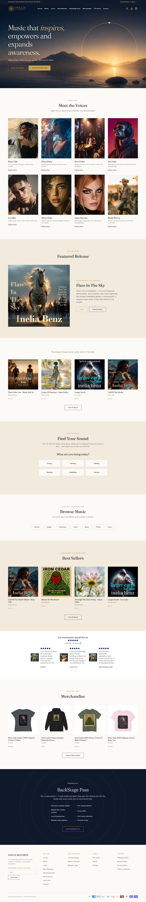

# Inelia — Custom Shopify Theme

A custom Shopify Online Store 2.0 theme built from scratch for **Inelia**, by [Bilal Burney](https://github.com/BilalBurni).

🔗 **Live store:** [ineliarecords.com](https://ineliarecords.com/)

## Homepage

<!-- HOMEPAGE SCREENSHOT -->


## About this theme

- Built from scratch. No paid or pre-made theme was used as a base.
- Uses Online Store 2.0 JSON templates, so the merchant can edit every section from the theme editor.
- Responsive layout for mobile, tablet and desktop.
- Written in Liquid, CSS and vanilla JavaScript.

## Theme at a glance

| | Count |
|---|---|
| Sections | 89 |
| Snippets | 83 |
| Theme blocks | 4 |
| Templates | 56 |

**Sections:** `announcement-bar`, `apps`, `bulk-quick-order-list`, `cart-drawer`, `cart-icon-bubble`, `cart-live-region-text`, `cart-notification-button`, `cart-notification-product`, `collage`, `collapsible-content`, `collection-list`, `collection-tuneboom-playlist`, `contact-form`, `custom-liquid`, `email-signup-banner`, `featured-blog`, `featured-collection`, `featured-product`, `footer`, `header`, `image-banner`, `image-with-text`, `inelia-artist-bio`, `inelia-artists`, `inelia-backstage-cta`, `inelia-backstage-teaser`, `inelia-browse-music`, `inelia-featured-release`, `inelia-find-your-sound`, `inelia-footer`, `inelia-free-song-choice`, `inelia-free-song-download`, `inelia-free-song-signup`, `inelia-hero`, `inelia-library`, `inelia-locked-teaser`, `inelia-members-content`, `inelia-new-releases`, `inelia-product-showcase`, `inelia-voice-lineup`

## Structure

```
assets/      CSS, JavaScript, fonts and images
config/      Theme settings schema and defaults
layout/      theme.liquid and other base layouts
locales/     Translation strings
sections/    Customizable page sections
snippets/    Reusable Liquid partials
templates/   JSON page templates
```

## Try it locally

```bash
shopify theme dev --store your-store.myshopify.com
```

---

Need a custom Shopify store? Contact me on [GitHub](https://github.com/BilalBurni).
